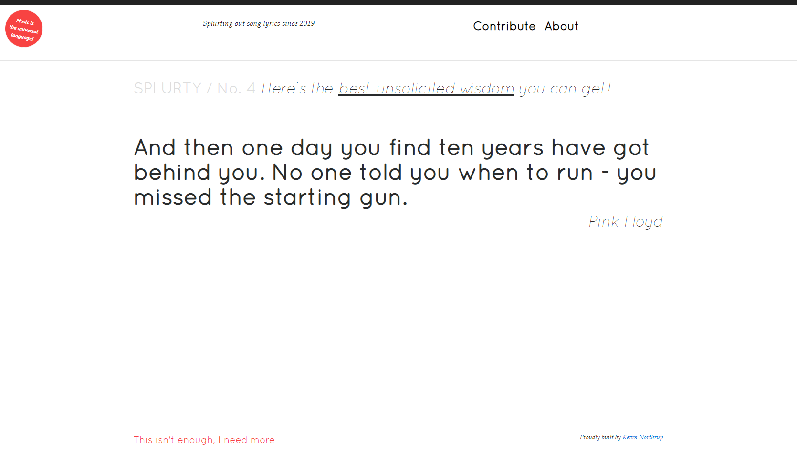

# Splurty

Splurty displays a random song lyric quote pulled from a database of user-submitted quotes.
  
  
[View the deployed application](https://splurty-kevin-northrup.herokuapp.com/)
___

### Features:
- Built using Ruby on Rails
- Twitter Bootstrap3 for CSS and components
- PostgreSQL database
- Modal used for quote submissions
- Validation for form inputs
- Simple Form gem for form generation
- Quotes load randomly upon page refresh

___
### Screenshot:

